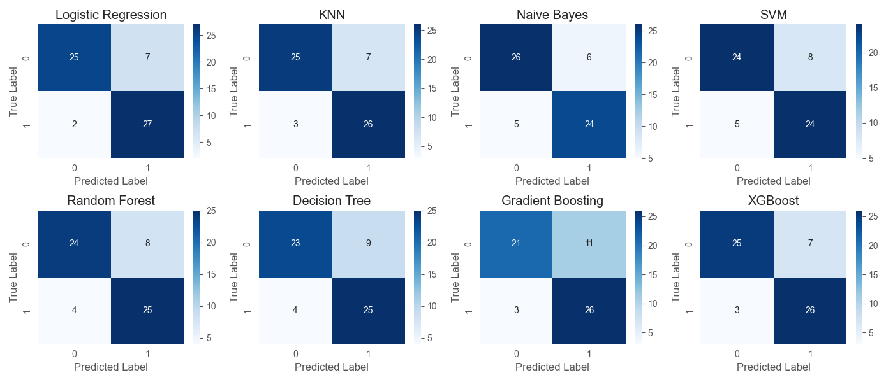

# Heart Disease Detection

## Table of Contents

- **[Getting Started](#getting_started)** <br>
- **[Introduction](#introduction)** <br>
- **[Data Source and Acknowledgments](#data_source)** <br>
- **[Project Process](#project_process)** <br>
- **[Sample Visualizations](#sample_visuals)** <br>
- **[License](#license)** <br> 

<a id="getting_started"></a>
## Getting Started 
To get started with this project, follow the steps below:

### Prerequisites

Ensure you have the following installed on your local machine:

- [Python](https://www.python.org/downloads/release/python-390/) (version 3.9 recommended)
- [Jupyter Notebook](https://jupyter.org/)

### Configuration

1. Clone the repository to your local machine:

   ```bash
   git clone https://github.com/Nazgul773/heart_disease_detection.git

2. Set up a virtual environment (optional but recommended):
   ```bash
   # Create a virtual environment
   python -m venv venv
   ```
   ```bash
   # Activate the virtual environment
   source venv/bin/activate   # For Linux/macOS
   ```
   ```bash
   .\venv\Scripts\activate    # For Windows
   ```
3. Install the required Python packages:
   ```bash
    pip install pandas matplotlib seaborn scikit-learn
   ```
4. Launch the Notebook:
   ``` bash
   jupyter notebook heart_disease_detection.ipynb
   ```
<a id="introduction"></a>
## Introduction 
This project aims to predict the presence of heart disease in patients using machine learning techniques. The dataset contains various attributes such as age, cholesterol levels, and exercise-induced angina, which are used to train the models.

<a id="data_source"></a>
## Data Source and Acknowledgments

The dataset used in this project is publicly available and can be found at [Kaggle](https://www.kaggle.com/datasets/johnsmith88/heart-disease-dataset). 
### Acknowledgments

Special thanks to [Kaggle](https://www.kaggle.com) for providing the dataset, as well as:

- [Pandas](https://pandas.pydata.org/) for its powerful data manipulation capabilities, and
- [Seaborn](https://seaborn.pydata.org/) for its contribution to insightful data visualization.
- [Scikit-learn](https://scikit-learn.org/stable/) for its wide range of machine learning algorithms and tools for model training, evaluation, and hyperparameter tuning.

These tools significantly contributed to the success of the heart disease detection project by enabling efficient data processing, visualization, and modeling

<a id="project_process"></a>
## Project Process

### Data Collection and Preprocessing
The project began with the acquisition of the heart disease dataset from [Kaggle](https://www.kaggle.com/datasets/johnsmith88/heart-disease-dataset). This dataset contains various attributes such as age, cholesterol levels, and exercise-induced angina, among others, which were considered potential predictors of heart disease. Upon loading the dataset using pandas, initial exploration and preprocessing were performed. This involved checking for missing values, duplicates, and determining the distribution of continuous and categorical features.

### Feature Analysis and Selection
To gain insights into the relationships between features and the target variable, exploratory data analysis (EDA) techniques were employed. Histograms and count plots were created to visualize the distribution of continuous and categorical features, respectively. Additionally, a correlation matrix heatmap was generated to examine the pairwise correlations between features. Based on the EDA findings, certain features that were deemed less relevant or redundant were dropped from the dataset to improve model performance.

### Model Development and Evaluation
The heart disease detection task was approached as a supervised machine learning classification problem. Several popular classification algorithms, including Logistic Regression, K-Nearest Neighbors (KNN), Random Forest, and XGBoost, were trained and evaluated using the preprocessed dataset. A pipeline was utilized to streamline the data preprocessing steps, including feature scaling using StandardScaler, and the training of each model was conducted using the training set. Hyperparameter tuning was performed for each model using grid search with cross-validation to identify the optimal hyperparameters.

### Model Performance Metrics
The performance of each trained model was evaluated using a variety of metrics, including accuracy, precision, recall, specificity, and F1-score. These metrics were calculated using the test set predictions generated by each model. Additionally, confusion matrices were visualized to provide further insights into the performance of the models in terms of true positive, true negative, false positive, and false negative predictions.

### Conclusion and Future Directions
Based on the model performance metrics, Logistic Regression and Random Forest emerged as the top-performing models for heart disease detection, achieving accuracy scores of 85% and exhibiting balanced precision and recall. However, there is still room for improvement, and future work could involve exploring additional features, optimizing model hyperparameters further, and deploying the trained model for real-world applications.


<a id="sample_visuals"></a>
## Sample Visualizations




<a id="license"></a>
## License
This Project is [MIT](LICENSE) licensed.
